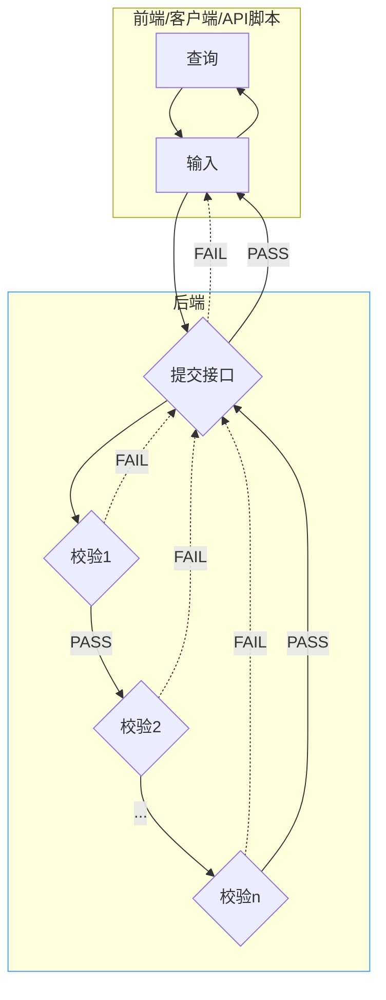

# Markdown Samples

> An awesome project.

codes:
```bash
echo "hello world"
```

mermaid sample:

```mermaid
graph TD;
    subgraph Front[前端/客户端/API脚本]
    A[查询]-->B[输入];
    B-->A;
    end
    subgraph Back[后端]
    style Back stroke:#409eff
    B-->D{提交接口};
    D-.->|FAIL|B;
    D-->C1{校验1};
    C1-.->|FAIL|D;
    C1-->|PASS|C2{校验2};
    C2-.->|FAIL|D;
    C2-->|...|Cn{校验n};
    Cn-.->|FAIL|D;
    Cn-->|PASS|D;
    D-->|PASS|B;
    end
```