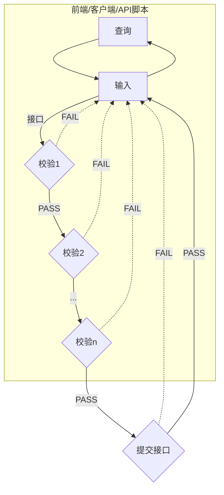
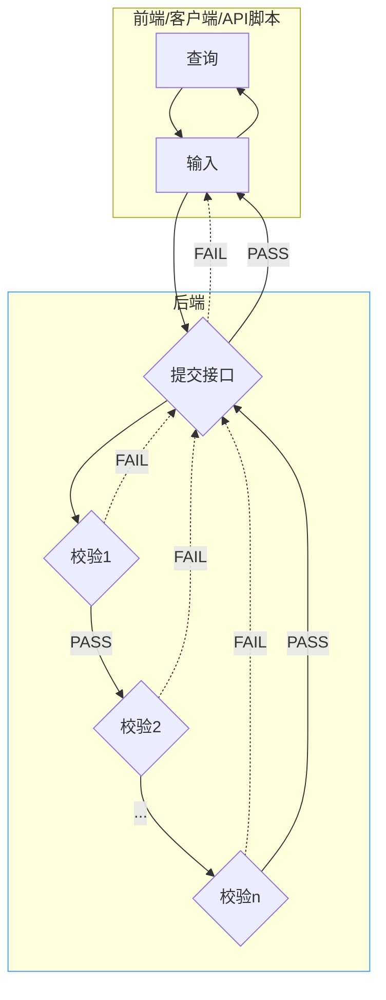

# 前后端分离的应用设计

B/S架构的应用在功能的设计开发上，都遵循查询/输入->接口/校验->结果的流程。无论是Web前端、客户端、移动APP（PDA），还是接口测试脚本，主要执行数据查询/输入和接口请求发起，可统一看作前端，以下流程设计分析以PDA为例进行说明，但是适用于所有前后端分离的应用模式，这里的前端包括但不限于客户端、移动APP、接口测试脚本等。

## 旧版PDA模式设计
*下图因为耦合度太高，连mermaid都没法直接生成*

现有很多MES2的PDA都是按照这种模式开发的，从校验1到校验N，其中一些都要调接口校验，所以后端需要开发N个校验接口以及最后执行业务提交的接口。由前端在输入后依次调校验接口，根据接口校验结果判断是否执行下一步输入或提交。

我们发现这种方式存在一些问题：
1. 校验逻辑全部在前端执行，提交接口通常不进行校验，如果直接调接口会写入未经校验的异常数据；
2. 前端调用接口较多，通常前端一个http请求经历三次握手，比UI交互要费时，减少前端的接口调用次数会增加前端响应速度和用户体验；
3. 前端代码叠加了校验接口逻辑，假如需要扩展至不同平台的前端，比如客户端应用复制到Android PDA，或者写业务压测脚本，叠加了校验接口逻辑就需要在不同平台都重复开发一遍；
4. 维护复杂。当出现异常问题排查时，策划人员、前端开发、后端人员均需要了解复杂的前端校验逻辑；一旦校验逻辑需要变化，前、后端都需要经历修改、测试和发布的流程；当代码开发时间久或者换开发/策划人员时，代码交接与迭代开发维护过程非常费时；
5. 当不同工厂（服务器）对应的校验逻辑不相同时，臃肿的前端代码难以统一；

## 前后端分离的设计模式

B/S架构的应用应该遵循轻量级前端的原则，前端只做用户交互中的查询和输入，数据校验和修改按业务划分使用指定的一个提交接口处理，流程如下图所示：

遵循这种设计的应用，测试和调试不再依赖于前端界面，集中在一个业务接口即可。对于策划人员调试分析问题、开发人员编写测试脚本、维护升级代码都更容易。

### 已按旧版设计模式开发的应用如何优化？
> 后端新增一个提交接口，封装处理已有的校验接口和原提交接口；
> 
> 前端去掉所有校验相关的接口和判断，输入完成后直接调用新增的提交接口；