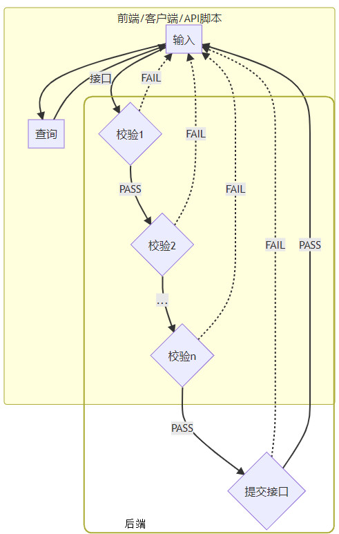
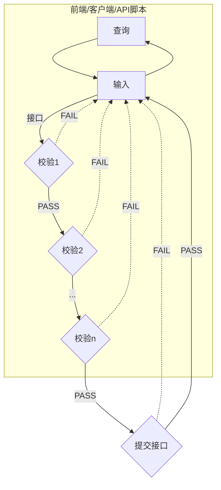
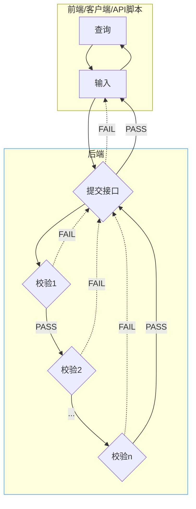

# 前后端分离的应用设计

B/S架构的应用在功能的设计开发上，都遵循查询/输入->接口/校验->结果的流程。无论是Web前端、客户端、移动APP（PDA），还是接口测试脚本，都主要负责数据查询/输入和接口请求发起，可统一看作前端，以下流程设计分析以PDA为例进行说明，但是适用于所有前后端分离的应用模式，包括但不限于客户端、移动APP、接口测试脚本等。

## 旧版PDA模式设计

从校验1到校验N，其中一些都要调接口校验，所以后端需要开发N个校验接口以及最后执行业务提交的接口。由前端在输入后依次调校验接口，根据接口校验结果判断是否执行下一步输入或提交。

这种方式存在一些问题：

## 前后端分离的设计模式

